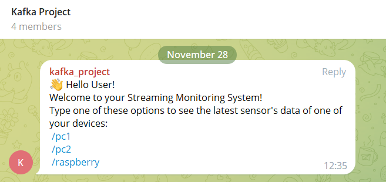
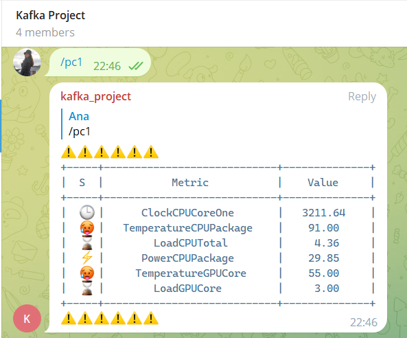
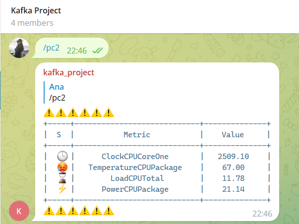
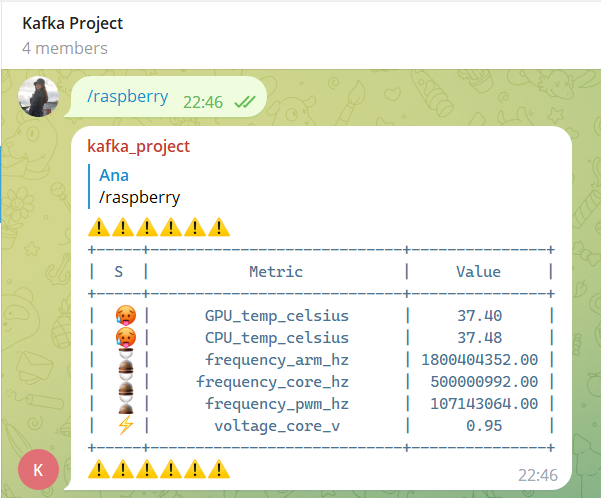
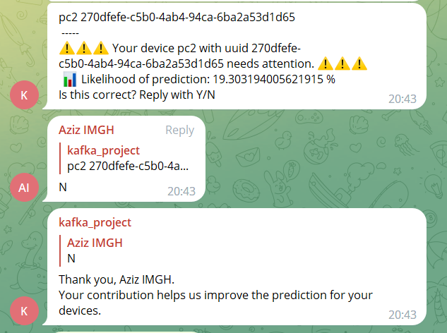

# Telegram Bot

We use a Telegram Bot in order to `alert` the user in **real-time** when one his devices is stressed, so he can act 
accordingly and also for `monitoring` so the user can freely ask the bot for the latest sensor's measurements about any 
of his devices and the bot will reply with it using a table format.

This bot is`Dockerized` and deployed in an `AWS EC2` instance being available 24/7.


## Run locally

````shell
cd telegrambot
````

````shell
pip install -r requirements.txt
````

````shell
python main_telegram.py
````


Some images from the Telegram Group:










